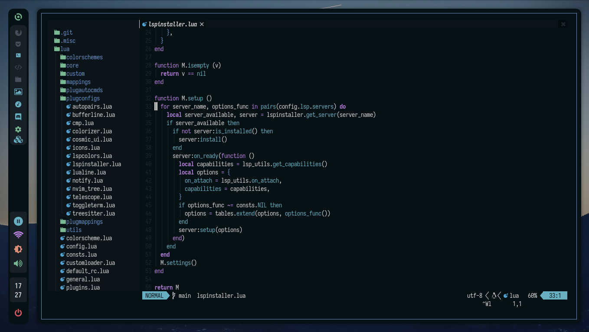

# night.nvim

night.nvim is a beautiful, dark and cleaner colorscheme based in the colorscheme showed in the rxyhn dotfiles

## Screenshots



## External Plugin Support

- Telescope
- Nvim Tree
- Tresitter
- Lsp
- Lsp saga
- Coc
- Bufferline
- Illuminate
- Diff
- Git signs
- Git gutter
- Lualine
- Ident-BlankLine

## Installation

You can install this plugin with packer:

```lua
use { 'NightCS/night.nvim', as = 'night' }
```

Or with vim-plug:

```vim
Plug 'NightCS/night.nvim', { 'as': 'night' }
```

## Active theme

To active the theme call this in your neovim config:

```lua
local night = require('night')

night.setup({ nvim_tree = { contrast = true } }) -- or use contrast = false to not apply contrast
```

Or with vim script:

```vim
colorscheme night
```

> It will set automatically the `vim.opt.termguicolors` to true

## Activating lualine theme

Place this in your lualine config:

```lua
local lualine = require('lualine')

lualine.setup {
  options = {
    theme = 'night-nvim',
  },
}
```

## Using the core to get the colors

If you want to get the colors into a lua dictionary

```lua
local night = require('night.core')
local colors = night.get_colors()
```
